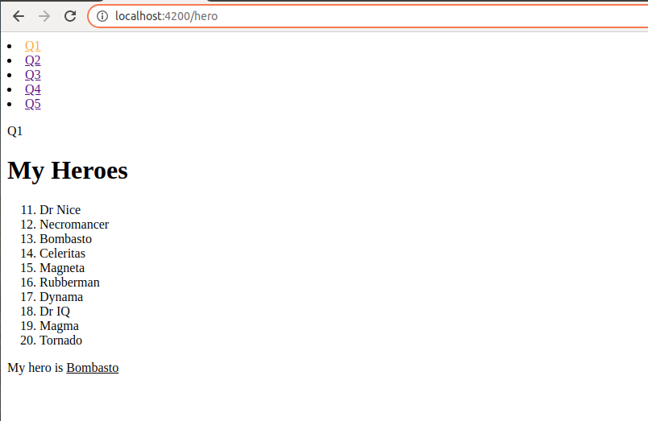

# IA Group Assessment

This repository aims to provide solutions for the given problems. 
Written by Mapichit Kularb

## Table of Contents
1. [Tools](#tools)
2. [Setup](#setup)
3. [Run](#run)
4. [Results](#Results)
   1. [Q1](#q1)
   2. [Q2](#q2)
   3. [Q3](#q3)
   4. [Q4](#q4)
   5. [Q5](#q5)


## Tools
- Frontend for `Q1, Q2, and Q5`
  - Angular
  - TypeScript
- Backend for `Q3 and Q4`
  - node.js
  - express.js
  - TypeScript
- Postman for `REST API`

where all the source code is under this following directory:
```
// scr frontend
|--+ frontend
   |--+ src
      |--+ app
         |--+ assessment1-hero
         |--+ assessment2-api-call
         |--+ assessment3-triangle
         |--+ assessment4-citizen-id
         |--+ assessment5-diamond

// scr backend
|--+ backend
   |--+ server.ts
```

## Setup

node `16.16` LTS with npm `8.1.0`

To install Angular:
```
$ npm install -g @angular/cli
```

To install frontend package:
```
$ cd frontend
$ npm i
```

To install backend package:
```
$ cd backend
$ npm i
```

## Run
For frontend side, it contains the solutions for `Q1, Q2, and Q5`:
```
$ cd frontend
$ ng serve
```

and for backend providing solutions for `Q3 and Q4`:
```
$ cd backend
$ npm start 
```

## Results

### Q1



### Q2


### Q3


### Q4


### Q5

